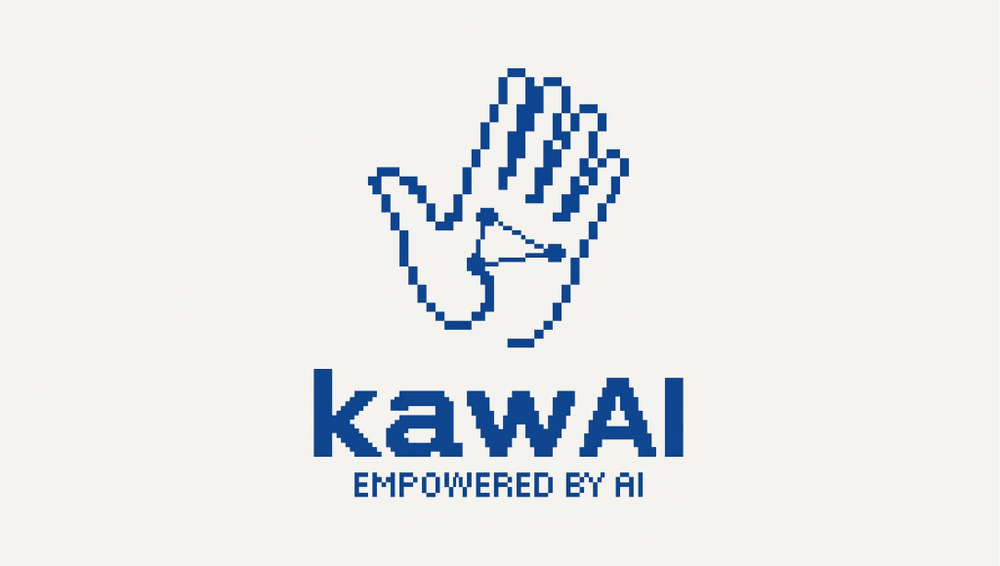
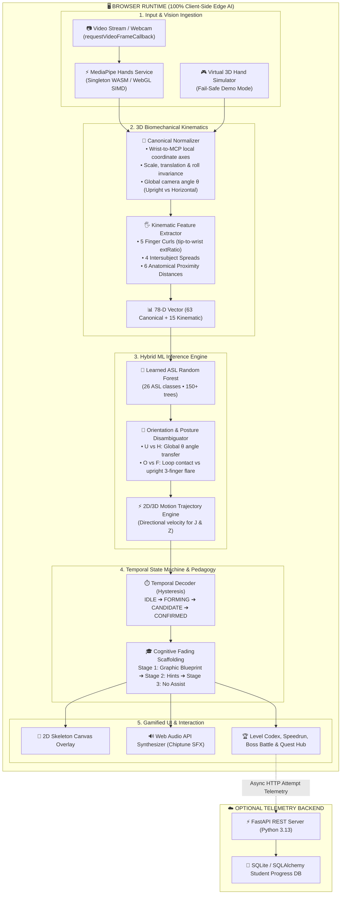

<p align="center">
  
</p>

<h1 align="center">KawAI</h1>
<h3 align="center"><em>EMPOWERED BY AI • Learn. Sign. Level Up.</em></h3>

<p align="center">
  <strong>Gamified ASL Fingerspelling & Sign Language Adventure</strong><br />
  <em>Built for the RAITE 2026 AI in Education Hackathon</em>
</p>

<p align="center">
  <a href="https://vercel.com/new/clone?repository-url=https://github.com/akiyun02/kawAI&root-directory=frontend">
    
  </a>
</p>

---

## 🌟 Overview
**KawAI** is an AI-powered, arcade-gamified sign-language learning platform that uses real-time computer vision through the student's webcam to evaluate hand signs and fingerspelling.

Instead of a binary "correct / wrong" quiz, KawAI decomposes sign kinematics into **three biomechanical pillars**:
1. **Hand Shape** (Finger curl, extension, isolation, thumb abduction)
2. **Hand Orientation** (3D Palm normal vector, wrist angle relative to viewer)
3. **Spatial Positioning & Framing** (Bounding box centering, height, motion)

This empowers the system to deliver personalized, encouraging feedback like:
> *"Your finger shape is spot on, but your palm orientation is rotated inward toward yourself. Turn your palm to squarely face the camera."*

---

## 🚀 Live Demo & Quickstart

### 1. Frontend Web Client (Runs 100% Client-Side In-Browser)
```bash
cd frontend
npm install
npm run dev
```
Open **`http://127.0.0.1:5173`** in your browser.

> [!NOTE]
> All MediaPipe landmark extraction, 26-class trained ML inference, biomechanical calculations, and sound effects execute **100% locally in your browser** with zero required backend dependencies!

### 2. Optional Backend Server (FastAPI Telemetry)
```bash
cd backend
python -m uvicorn main:app --host 127.0.0.1 --port 8000 --reload
```
- API Docs: `http://127.0.0.1:8000/docs`
- Health check: `http://127.0.0.1:8000/api/health`

---

## 🎮 Game Modes

| Mode | Purpose | Mechanics |
| :--- | :--- | :--- |
| **1. Learn Codex** | Foundational Sign Instruction | Anatomical reference card, 3D vector cues, live camera skeleton mesh, real-time diagnostic breakdown (Shape, Orientation, Position). |
| **2. Practice Dojo** | Adaptive Flashcards | Adaptive drills tailored to student's current skill tier; tracks accuracy, reaction time, streaks, and confidence. |
| **3. Speed Run (30s)** | High-Pressure Rapid Sprint | Rapid sign prompts under a 30s countdown; chain combos up to 5x multiplier; earn **S/A/B/C Rank Tiers** and save your Personal Best. |
| **4. Word Builder** | Sequential Fingerspelling | Construct full words letter-by-letter (`KAWAI`, `ASL`, `CAT`, `SIGN`, `ROBOT`, `JOY`, `ZEBRA`) with transition gating. |
| **5. Sign Detective** | Forensic Mystery Investigation | Case files like `Case #033: The KawAI Cipher` and `Case #014: The Library Secret`. Decrypt clues to unlock secrets! |
| **6. Boss Battle** | End-of-Unit Climax | Face *The Silent Guardian* across 4 combat phases (B, A, C, L). Boss attacks dynamically test your orientation weaknesses; earn +1000 XP! |
| **7. Skill Tree** | RPG Mastery Matrix | Foundations $\to$ Alphabet $\to$ Numbers $\to$ Words $\to$ Phrases $\to$ Conversation. Track stars and launch direct drills. |
| **8. Teacher Portal** | Privacy-Conscious Class Analytics | Aggregate student telemetry, most difficult signs, common kinematic error charts, and AI Class Challenge launcher. |

---

## ☁️ Deploy to Vercel

KawAI is ready for instant deployment to **Vercel**:

1. Fork or push this repository to GitHub.
2. In [Vercel](https://vercel.com/new), import your repository.
3. Set **Root Directory** to `frontend`.
4. Framework Preset will auto-detect as **Vite**.
5. Click **Deploy**!

Both root [`vercel.json`](./vercel.json) and [`frontend/vercel.json`](./frontend/vercel.json) are pre-configured with SPA route rewriting.

---

## 🛡️ Hackathon Presenter's "Demo Mode"
KawAI defaults to your **live webcam**, but also includes a **fail-safe Presentation Mode** accessible via the top HUD toggle or `Alt + D`.

When presenting in environments with poor lighting, strict webcam permissions, or stage hardware:
1. Toggle **SIMULATOR / WEBCAM**. The system switches to the mathematical 3D hand simulator.
2. The **Presenter Toolbar** appears at the bottom of the camera feed:
   - `[✓ Perfect Sign]` $\to$ Demonstrates instant recognition, +100 XP, and arpeggiated success chime.
   - `[⚠ Inward Palm (Orientation)]` $\to$ Demonstrates the AI identifying the specific biomechanical orientation flaw (*"Palm rotated inward toward yourself"*).
   - `[⚠ Curl Issue (Shape)]` $\to$ Demonstrates finger curvature diagnostic.
   - `[⚠ Off-Center]` $\to$ Demonstrates framing advice.

---

## 🔒 Responsible AI & Privacy Charter
- **100% Local CV Execution**: Webcam frames are evaluated client-side in WebAssembly/WebGL using MediaPipe Hands. No camera feeds or video streams are ever uploaded or stored.
- **Deaf Culture & Inclusive Framing**: Grounded in natural human language appreciation; explicitly rejects medical deficit models.
- **Accessibility Ready**: Built-in High Contrast mode, Large Readable Text toggle, and Web Audio synthesis (usable sound-free with screen-reader cues).

---

## 🏛️ System Architecture

KawAI runs an end-to-end edge AI pipeline directly in the browser at 30–60 FPS with zero cloud roundtrip latency and complete data privacy:



### High-Level Architectural Flow
1. **High-Performance Ingestion**: The camera stream feeds into a pre-warmed singleton `MediaPipeService` utilizing `requestVideoFrameCallback` to synchronize frame decoding with display refresh rates at near-zero CPU idle overhead.
2. **Canonical Hand Space**: 21 raw $(x,y,z)$ coordinates are projected into an invariant hand coordinate frame aligned along the middle metacarpal axis.
3. **Hybrid Classification**: The 78-dimensional feature vector is simultaneously passed to the Random Forest model and our orientation filters (disambiguating sister signs like **U vs H** and **O vs F**).
4. **Hysteresis Temporal Decoder**: Eliminates single-frame webcam jitter through a 350ms evidence accumulation buffer before triggering gamified rewards.
5. **Scaffolded Learning Progression**: Fades assistance from **Graphic Blueprints** (Level 1 Vowels) to **Hints Only** to **No-Assist Blind Recall**.

---

## 🏗️ Technical Stack

| Layer | Technologies Used | Key Purpose |
| :--- | :--- | :--- |
| **Frontend Framework** | **React 19, TypeScript 5.8, Vite 8.3** | High-performance reactive UI, strict type safety, instant HMR, optimized bundle chunking. |
| **Edge Computer Vision** | **MediaPipe Hands (WASM / WebGL SIMD)** | 21-landmark 3D hand articulation tracking in-browser at 30+ FPS without server processing. |
| **Machine Learning** | **Random Forest Classifier (Ensemble of 150+ Decision Trees)** | Real-time classification trained on ASL signer datasets with leaf probability accumulation. |
| **Biomechanical Analysis**| **Vector Kinematics & Euler Angle Normalizer** | Scale-invariant finger curl ratio, inter-finger abduction spread, and palm normal 3D vectors. |
| **Temporal Decoding** | **Hysteresis State Machine & Motion Signatures** | Continuous evidence accumulation, transition suppression, and directional path integration for dynamic signs (J & Z). |
| **Audio Engine** | **Web Audio API (Custom Chiptune Synthesizer)** | Procedural arpeggios, streak combo chimes, and retro 8-bit sound effects with zero external audio assets. |
| **Styling & Retro Theme**| **Tailwind CSS 3.4, Lucide Icons, Canvas Confetti** | Chunky arcade handheld aesthetic, responsive layout, dark/light contrast, accessible text. |
| **Backend & Telemetry** | **FastAPI, Python 3.13, SQLite, SQLAlchemy, Pydantic** | Optional student telemetry storage, class metrics, confusion matrix benchmarks, and analytics. |
| **Deployment & Hosting**| **Vercel Edge Platform** | Zero-config continuous deployment with SPA rewrites and edge CDN caching. |

---

<p align="center">
  <strong>KawAI</strong> — Built with ❤️ for the RAITE 2026 AI in Education Hackathon.
</p>
